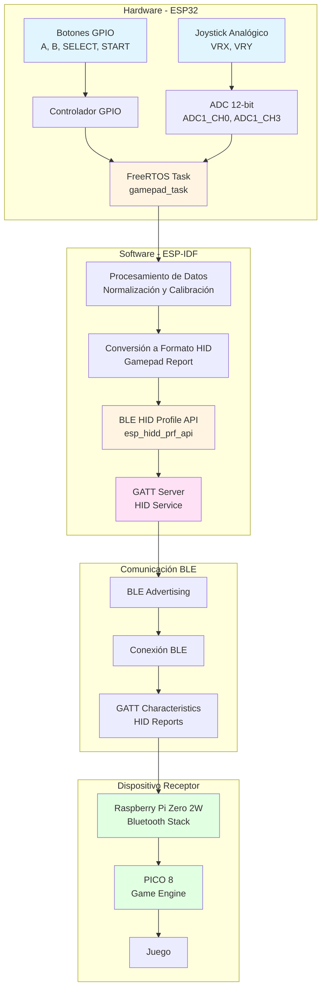
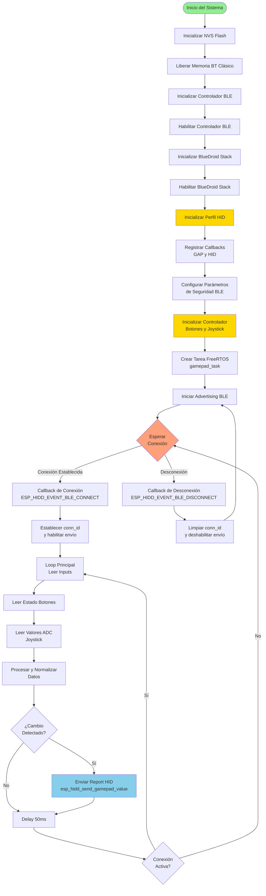
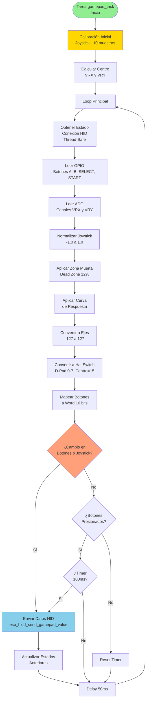
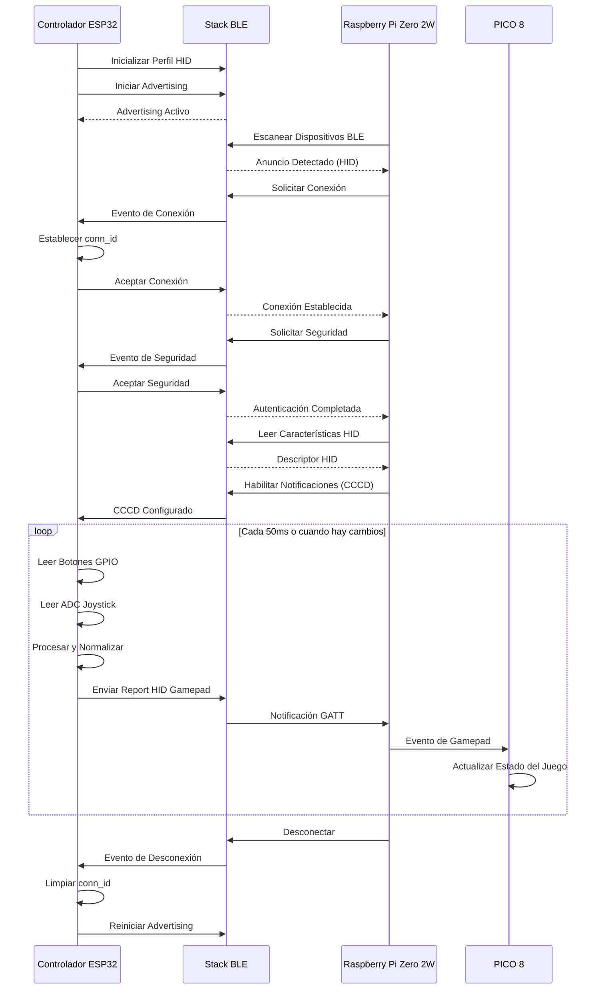

# Controlador de Juego DIY BLE HID para Raspberry Pi Zero 2W con PICO 8

## Descripción del Proyecto

Este proyecto implementa un controlador de juego DIY basado en ESP32 que funciona como un dispositivo HID (Human Interface Device) a través de Bluetooth Low Energy (BLE). El controlador está diseñado para conectarse a cualquier dispositivo compatible con BLE HID, con especial enfoque en su uso con una Raspberry Pi Zero 2W ejecutando PICO 8, permitiendo jugar desde cualquier dispositivo de forma inalámbrica.

El sistema consta de cuatro botones digitales (A, B, SELECT, START) y un joystick analógico de dos ejes, que se leen continuamente y se transmiten como datos de gamepad a través del protocolo BLE HID. El controlador implementa el perfil HID estándar, lo que permite su reconocimiento automático por parte de sistemas operativos compatibles sin necesidad de drivers adicionales.

## Arquitectura del Sistema

### Diagrama de Bloques



### Componentes Principales

El sistema se compone de los siguientes módulos:

1. **Módulo de Hardware (`controller.c/h`)**: Gestiona la lectura de botones GPIO y el joystick analógico mediante ADC.
2. **Módulo BLE HID (`esp_hidd_prf_api.c/h`)**: Implementa la API del perfil HID sobre BLE.
3. **Módulo de Perfil HID (`hid_device_le_prf.c`)**: Define el servicio GATT HID y sus características.
4. **Módulo Principal (`ble_hidd_demo_main.c`)**: Coordina la inicialización del sistema y maneja los eventos BLE.
5. **Módulo de Definiciones HID (`hid_dev.c/h`)**: Contiene las definiciones del estándar HID.

## Flujo de Funcionamiento

### Diagrama de Flujo Principal



### Diagrama de Flujo de la Tarea del Gamepad



## Descripción Detallada del Flujo de Código

### 1. Inicialización del Sistema (`app_main`)

El sistema inicia en la función `app_main()`, que realiza la secuencia de inicialización completa:

1. **Inicialización de NVS**: Se inicializa el sistema de almacenamiento no volátil (NVS) para guardar configuraciones persistentes.
2. **Configuración del Controlador BLE**: Se libera la memoria del Bluetooth Clásico y se inicializa el controlador BLE con la configuración por defecto.
3. **Inicialización del Stack BlueDroid**: Se inicializa y habilita el stack Bluetooth de Android (BlueDroid), que proporciona las APIs de BLE.
4. **Inicialización del Perfil HID**: Se inicializa el perfil HID mediante `esp_hidd_profile_init()`, que prepara el entorno para el servicio HID.
5. **Registro de Callbacks**: Se registran los callbacks para eventos GAP (Generic Access Profile) y HID mediante `esp_ble_gap_register_callback()` y `esp_hidd_register_callbacks()`.
6. **Configuración de Seguridad**: Se configuran los parámetros de seguridad BLE, incluyendo autenticación, capacidad I/O, tamaño de clave y máscaras de distribución de claves.
7. **Inicialización del Controlador**: Se llama a `controller_init()` para inicializar los botones GPIO y el ADC del joystick.

### 2. Inicialización del Controlador (`controller_init`)

La función `controller_init()` prepara el hardware del controlador:

1. **Creación de Mutex**: Se crea un semáforo mutex para acceso thread-safe a la información de conexión HID.
2. **Inicialización de Botones**: Se configuran los pines GPIO 13, 12, 25 y 26 como entradas con pull-up interno para los botones A, B, SELECT y START respectivamente.
3. **Inicialización del ADC**: Se configura el ADC1 con los canales 0 y 3 (GPIO 36 y 39) para leer los valores analógicos del joystick (VRX y VRY).
4. **Calibración del ADC**: Se inicializa la calibración del ADC usando el esquema de curve fitting o line fitting según disponibilidad.
5. **Creación de Tarea**: Se crea una tarea FreeRTOS llamada `gamepad_task` con prioridad 5 y stack de 4096 bytes, que ejecutará el loop principal de lectura y envío de datos.

### 3. Proceso de Advertising y Conexión BLE

Una vez inicializado el sistema, se inicia el proceso de advertising:

1. **Configuración de Advertising**: Se configura el nombre del dispositivo como "HID" y se establecen los parámetros de advertising, incluyendo el UUID del servicio HID (0x1812).
2. **Inicio de Advertising**: El dispositivo comienza a transmitir paquetes de advertising que anuncian su disponibilidad como dispositivo HID.
3. **Espera de Conexión**: El sistema espera a que un dispositivo host (como la Raspberry Pi) inicie una conexión.
4. **Establecimiento de Conexión**: Cuando se establece la conexión, se dispara el evento `ESP_HIDD_EVENT_BLE_CONNECT` en el callback `hidd_event_callback()`.
5. **Configuración de Seguridad**: Si el host solicita seguridad, se responde positivamente y se completa el proceso de autenticación y bonding.

### 4. Loop Principal de Lectura (`button_task`)

La tarea `button_task` ejecuta un loop continuo que lee y procesa las entradas:

#### 4.1 Calibración Inicial

Al iniciar la tarea, se realiza una calibración del joystick tomando 10 muestras de los valores ADC en reposo para determinar el punto central real del joystick, compensando cualquier offset del hardware.

#### 4.2 Lectura de Entradas

En cada iteración del loop (cada 50ms):

1. **Lectura Thread-Safe de Conexión**: Se obtiene el estado de la conexión HID de forma thread-safe usando el mutex.
2. **Lectura de Botones**: Se leen los niveles GPIO de los cuatro botones. Un nivel bajo (0) indica botón presionado debido a la configuración pull-up.
3. **Lectura del Joystick**: Se leen los valores del ADC para ambos ejes (VRX y VRY) y se convierten a milivoltios usando la calibración.

#### 4.3 Procesamiento de Datos

Los datos del joystick se procesan mediante varios pasos:

1. **Normalización**: Los valores en milivoltios se normalizan a un rango de -1.0 a 1.0, donde 0.0 representa el centro.
2. **Aplicación de Zona Muerta**: Se aplica una zona muerta del 12% para evitar drift cuando el joystick está en reposo.
3. **Curva de Respuesta**: Se aplica una curva de respuesta suave que proporciona mayor sensibilidad cerca del centro y respuesta más lineal en los extremos.
4. **Conversión a Ejes**: Los valores normalizados se convierten a valores de 8 bits con signo (-127 a 127) para los ejes X e Y.
5. **Conversión a Hat Switch**: Si el movimiento supera un umbral del 40%, se convierte a un valor de hat switch (D-Pad) de 0-7, donde 0 es Norte, 2 es Este, 4 es Sur, 6 es Oeste, y los valores intermedios representan direcciones diagonales. Si está en el centro, se usa el valor 15.

#### 4.4 Mapeo de Botones

Los botones se mapean a un word de 16 bits según el estándar HID Gamepad:

- **Bit 0 (Button 1)**: Botón A (GPIO 13)
- **Bit 1 (Button 2)**: Botón B (GPIO 12)
- **Bit 10 (Button 11)**: Botón SELECT (GPIO 25)
- **Bit 11 (Button 12)**: Botón START (GPIO 26)

#### 4.5 Detección de Cambios y Envío

El sistema detecta cambios en el estado de los botones o en la posición del joystick:

1. **Detección de Cambios**: Se compara el estado actual con el estado anterior. Si hay cambios significativos (más de 2 unidades en los ejes o cambio en botones), se marca para envío.
2. **Envío Periódico**: Si hay botones presionados pero no hay cambios, se envía periódicamente cada 100ms para mantener la retroalimentación.
3. **Envío de Datos HID**: Si se cumple alguna condición de envío, se llama a `esp_hidd_send_gamepad_value()` con los datos procesados.

### 5. Envío de Datos HID (`esp_hidd_send_gamepad_value`)

La función `esp_hidd_send_gamepad_value()` construye y envía el report HID:

1. **Construcción del Report**: Se construye un buffer de 5 bytes con el formato:
   - Bytes 0-1: Botones (16 bits)
   - Byte 2: Hat switch (4 bits) + padding (4 bits)
   - Byte 3: Eje X (-127 a 127)
   - Byte 4: Eje Y (-127 a 127)
2. **Envío a través de GATT**: El report se envía a través de la característica GATT correspondiente al report ID del gamepad.
3. **Notificación**: Si el host ha habilitado las notificaciones (CCCD configurado), el report se envía automáticamente al host.

### 6. Manejo de Desconexión

Cuando el host se desconecta:

1. **Evento de Desconexión**: Se dispara el evento `ESP_HIDD_EVENT_BLE_DISCONNECT` en el callback.
2. **Limpieza de Estado**: Se limpia el `conn_id` y se marca la conexión como inactiva mediante `controller_clear_hid_connection()`.
3. **Reinicio de Advertising**: Se reinicia el proceso de advertising para permitir nuevas conexiones.

## Integración con Raspberry Pi Zero 2W y PICO 8

### Configuración en Raspberry Pi Zero 2W

La Raspberry Pi Zero 2W ejecuta un stack Bluetooth estándar que soporta dispositivos HID BLE. Para usar el controlador con PICO 8:

1. **Habilitar Bluetooth**: El Bluetooth debe estar habilitado en la Raspberry Pi.
2. **Emparejamiento**: El controlador se empareja automáticamente cuando se establece la conexión BLE.
3. **Reconocimiento como Gamepad**: El sistema operativo Linux reconoce automáticamente el dispositivo como un gamepad HID estándar.
4. **Uso en PICO 8**: PICO 8 detecta automáticamente los gamepads conectados y los mapea a sus controles internos.

### Mapeo de Controles en PICO 8

PICO 8 mapea automáticamente los controles del gamepad:

- **Botón A (Button 1)**: Generalmente mapeado a O (acción principal)
- **Botón B (Button 2)**: Generalmente mapeado a X (acción secundaria)
- **Botón SELECT (Button 11)**: Mapeado a SELECT
- **Botón START (Button 12)**: Mapeado a START
- **Hat Switch (D-Pad)**: Mapeado a las direcciones del D-Pad
- **Ejes X e Y**: Mapeados a los sticks analógicos

## Diagrama de Secuencia de Comunicación



## Especificaciones Técnicas

### Hardware

- **Microcontrolador**: ESP32 (cualquier variante soportada: ESP32, ESP32-C2, ESP32-C3, ESP32-C5, ESP32-C6, ESP32-C61, ESP32-H2, ESP32-S3)
- **Botones**: 4 botones digitales conectados a GPIO con pull-up interno
  - Botón A: GPIO 13
  - Botón B: GPIO 12
  - Botón SELECT: GPIO 25
  - Botón START: GPIO 26
- **Joystick**: Joystick analógico de 2 ejes
  - Eje X (VRX): GPIO 36 (ADC1_CH0)
  - Eje Y (VRY): GPIO 39 (ADC1_CH3)
  - Resolución ADC: 12 bits
  - Atenuación: 11 dB (rango 0-3.3V)

### Software

- **Framework**: ESP-IDF (Espressif IoT Development Framework)
- **Stack Bluetooth**: BlueDroid (BLE 4.2+)
- **Perfil HID**: Implementación completa del perfil HID sobre BLE
- **Sistema Operativo**: FreeRTOS
- **Frecuencia de Muestreo**: 20 Hz (50ms por muestra)
- **Formato de Datos**: HID Gamepad Report (5 bytes)

### Protocolo BLE

- **Tipo de Dispositivo**: Periférico BLE (Slave)
- **Servicio UUID**: 0x1812 (HID Service)
- **Modo de Advertising**: Indefinido (ADV_TYPE_IND)
- **Intervalo de Advertising**: 32-48 unidades (40-60ms)
- **Seguridad**: Autenticación y bonding habilitados
- **Tamaño de Clave**: 16 bytes

## Estructura de Archivos

```
proyecto-5-bluetooth-controller-2.0/
├── main/
│   ├── ble_hidd_demo_main.c      # Función principal y manejo de eventos BLE
│   ├── controller.c                # Lectura de botones y joystick, procesamiento
│   ├── controller.h                # Definiciones de pines y funciones del controlador
│   ├── esp_hidd_prf_api.c         # Implementación de la API del perfil HID
│   ├── esp_hidd_prf_api.h         # Interfaz de la API del perfil HID
│   ├── hid_device_le_prf.c         # Definición del servicio GATT HID
│   ├── hid_dev.c                   # Funciones auxiliares para construcción de reports HID
│   ├── hid_dev.h                   # Definiciones del estándar HID
│   └── hidd_le_prf_int.h           # Definiciones internas del perfil HID
├── CMakeLists.txt                  # Configuración de compilación
├── sdkconfig                       # Configuración del proyecto ESP-IDF
└── README.md                       # Este archivo
```

## Compilación y Flasheo

### Requisitos Previos

- ESP-IDF v4.4 o superior instalado y configurado
- Python 3.6 o superior
- Herramientas de compilación (CMake, Ninja)

### Pasos de Compilación

1. **Configurar el Target**:
   ```bash
   idf.py set-target esp32
   ```

2. **Compilar el Proyecto**:
   ```bash
   idf.py build
   ```

3. **Flashear y Monitorear**:
   ```bash
   idf.py -p /dev/ttyUSB0 flash monitor
   ```

   (Reemplazar `/dev/ttyUSB0` con el puerto serial correcto)

### Configuración de Pines

Si se necesitan cambiar los pines GPIO, modificar las definiciones en `main/controller.h`:

```c
#define GPIO_BUTTON_A       GPIO_NUM_13
#define GPIO_BUTTON_B       GPIO_NUM_12
#define GPIO_BUTTON_SELECT  GPIO_NUM_25
#define GPIO_BUTTON_START   GPIO_NUM_26
#define GPIO_JOYSTICK_VRX   GPIO_NUM_36  // ADC1_CH0
#define GPIO_JOYSTICK_VRY   GPIO_NUM_39  // ADC1_CH3
```

## Salida de Ejemplo

Cuando el sistema está funcionando correctamente, se observa la siguiente salida en el monitor serial:

```
I (584) BTDM_INIT: BT controller compile version [1342a48]
I (584) system_api: Base MAC address is not set
I (584) system_api: read default base MAC address from EFUSE
I (594) phy_init: phy_version 4670,719f9f6,Feb 18 2021,17:07:07
I (1024) HID_LE_PRF: esp_hidd_prf_cb_hdl(), start added the hid service to the stack database. incl_handle = 40
I (1034) HID_LE_PRF: hid svc handle = 2d
I (1034) CONTROLLER: Inicializando controlador de botones y joystick...
I (1044) CONTROLLER: Botones inicializados en GPIO: A=13, B=12, SELECT=25, START=26
I (1054) CONTROLLER: ADC inicializado para joystick: VRX=GPIO36 (ADC1_CH0), VRY=GPIO39 (ADC1_CH3)
I (1064) CONTROLLER: Joystick calibrado - Centro VRX: 1650 mV, Centro VRY: 1648 mV
I (1064) CONTROLLER: Sistema iniciado. Presiona botones o mueve el joystick para ver la salida.
I (5964) HID_LE_PRF: HID connection establish, conn_id = 0
I (5964) HID_DEMO: Conexion exitosa
I (5964) CONTROLLER: Conexión HID establecida (conn_id=0)
I (6744) HID_DEMO: remote BD_ADDR: 7767f4abe386
I (6744) HID_DEMO: address type = 1
I (6744) HID_DEMO: pair status = success
I (7024) CONTROLLER: Gamepad ENVIADO - Buttons: 0x0001 (A:1 B:0 SEL:0 ST:0), Hat: 15, X: 0, Y: 0
```

## Solución de Problemas

### El controlador no se conecta

- Verificar que el Bluetooth esté habilitado en el dispositivo receptor
- Asegurarse de que el dispositivo esté en modo de escaneo
- Verificar que no haya otros dispositivos HID conectados que puedan interferir

### Los botones no responden

- Verificar las conexiones físicas de los botones
- Comprobar que los pines GPIO estén correctamente configurados
- Revisar los logs del monitor serial para ver si se detectan cambios en los GPIO

### El joystick tiene drift o no responde correctamente

- Ajustar los valores de calibración del centro en `controller.c`
- Modificar el valor de `dead_zone` si el joystick tiene mucho drift
- Verificar que el joystick esté recibiendo alimentación estable de 3.3V

### PICO 8 no detecta el controlador

- Verificar que el controlador esté emparejado correctamente con la Raspberry Pi
- Comprobar que PICO 8 tenga soporte para gamepads habilitado
- Verificar los logs del sistema en la Raspberry Pi con `dmesg` o `journalctl`

## Referencias

- [ESP-IDF Programming Guide](https://docs.espressif.com/projects/esp-idf/en/latest/)
- [Bluetooth HID Profile Specification](https://www.bluetooth.com/specifications/specs/human-interface-device-profile-1-0/)
- [USB HID Usage Tables](https://www.usb.org/sites/default/files/documents/hut1_12v2.pdf)
- [PICO 8 Manual](https://www.lexaloffle.com/pico-8.php?page=manual)

## Licencia

Este proyecto está basado en el ejemplo BLE HID de ESP-IDF y utiliza la licencia Unlicense OR CC0-1.0.
